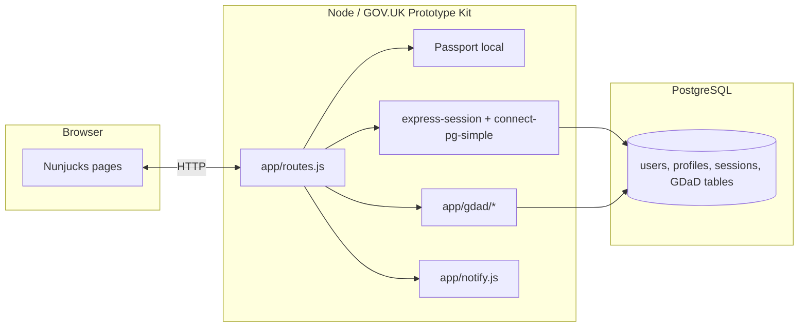

# Architecture and how it works

This note is aimed at developers **reviewing the repo for hardening** or **planning migration** off Heroku (for example onto Defra’s core delivery hosting). It stays high-level; implementation detail lives in the code and [`TECHNICAL_OVERVIEW.md`](TECHNICAL_OVERVIEW.md).

## Runtime shape

- **Presentation:** [`app/views`](app/views) (Nunjucks), GOV.UK Frontend via the kit; extra styling in [`app/assets/sass/application.scss`](app/assets/sass/application.scss).
- **HTTP surface:** Mostly [`app/routes.js`](app/routes.js). The GDaD feature set is modularised under [`app/gdad/`](app/gdad/) and **registered at the bottom** of `routes.js` via `registerGdAdRoutes(...)`.
- **Data:** [`app/db.js`](app/db.js) exposes a `pg` pool. **No separate ORM.** SQL is written in routes and gdad modules.
- **Outbound email:** [`app/notify.js`](app/notify.js) wraps GOV.UK Notify (`notifications-node-client`) for verification and optional service feedback emails.

## Request flow (conceptual order)

Middle order matters in Express.

1. **Session** — `express-session` with `connect-pg-simple`; session rows live in Postgres.
2. **Passport** — initialises and deserialises the user onto `req.user` when a session cookie is present.
3. **Development bypass** (`AUTH_BYPASS=true`, non‑production only) — can attach a synthetic `req.user` for local demos.
4. **`res.locals` (first block)** — `user`, `appVersion`, `feedbackLinkHref`, `currentPath`, admin flags, etc.
5. **Profile/GDaD role hints** — loads profile role where needed for navigation and GDaD applicability (skips heavy work without a user).
6. **`isAllowedWithoutAuthentication`** — global “public path” gate; routes such as `/login`, `/about`, `/how-it-has-been-built`, and `/feedback*` are enumerated explicitly (keep in sync with [`app/views/layouts/main.html`](app/views/layouts/main.html) footer links). See `PUBLIC_WITHOUT_SIGN_IN_*` and `isAllowedWithoutAuthentication()` in `routes.js`.
7. **Route handlers** — login/register/verify/about/feedback/browse/profile/admin/… .
8. **Second `res.locals` block** — repeats several assignments (historical layout); consolidating would be a small refactor without behaviour change beyond ordering.

Anything not matched as public and not authenticated is redirected to `/login`.

## Authentication and authorization

| Concern | Mechanism |
| --- | --- |
| Sign-in | `passport-local`, bcrypt password hashes in `users` |
| Verification | Email code on `users`; Notify when configured |
| Sessions | Cookie + server-side session row |
| Defence in depth per route | `ensureAuthenticated`, `ensureAdmin`, GDaD-specific guards in [`app/gdad/routes.js`](app/gdad/routes.js) |

**Public content** includes marketing-style pages (`/about`, `/how-it-has-been-built`) and the feedback funnel so problems can be reported without an account where that is intentional.

## Configuration

- **`app/config.json`** — `serviceName`, `releaseVersion`, plugin flags (`govuk-frontend.rebrand`).
- **Environment variables** — database URL, session secret, Notify keys/template IDs, allowlists/admin lists; see [`DEPLOYMENT_GUIDE.md`](DEPLOYMENT_GUIDE.md).

## Migrating hosting (Heroku → Defra core delivery or similar)

What usually changes:

| Area | Typical action |
| --- | --- |
| **Process model** | Keep `npm start` (kit) or wrap in whatever the platform mandates. |
| **Postgres** | Point `DATABASE_URL` (or equivalent) at the managed instance; TLS settings in `db.js` may need aligning with organisational policy (`rejectUnauthorized` is currently relaxed in production — review for hardened environments). |
| **Sessions** | Table already in Postgres (`connect-pg-simple`); ensure migrations/runbooks create it on fresh DBs. |
| **Secrets** | Inject via vault/parameter store patterns the platform expects. |
| **Static assets / CDN** | Prototype Kit serves bundled assets; platform-specific edge caching optional. |

This app is **not** written as twelve-factor microservices: it’s a single Node process with SSR. That simplifies migration but strengthens the case for dependency scanning, rate limits, and WAF/route rules at the edge.

## Code comments policy (for reviewers)

- Prefer **why** over **what** near non-obvious security or sequencing choices.
- **Footer ↔ public routes** linkage is commented in [`app/views/layouts/main.html`](app/views/layouts/main.html) and in `routes.js` alongside `PUBLIC_WITHOUT_SIGN_IN_*`.
- Large generated or kit-standard files generally stay comment-light to reduce merge friction.

Further reading: [`TECHNICAL_OVERVIEW.md`](TECHNICAL_OVERVIEW.md), [`DEPLOYMENT_GUIDE.md`](DEPLOYMENT_GUIDE.md), [`ROADMAP.md`](ROADMAP.md).
